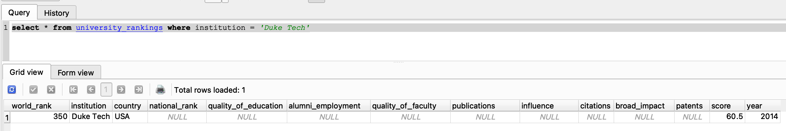
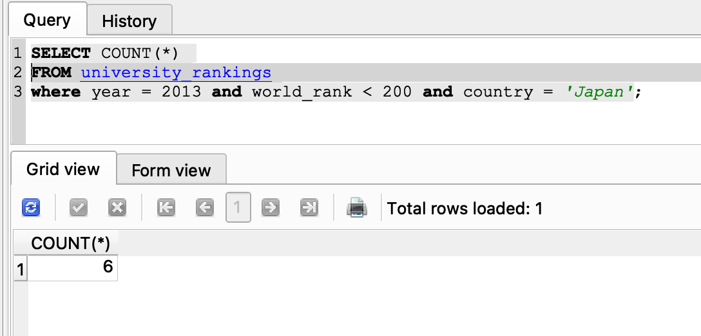
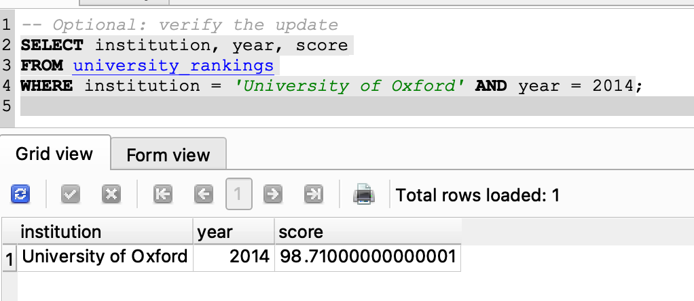
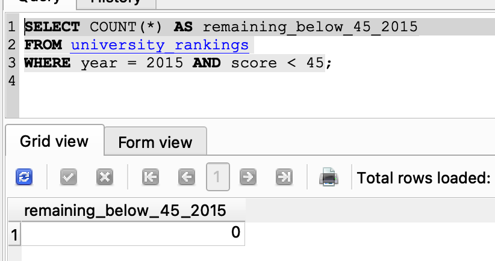

# Week 6 - Mini- Assignment Introduction to Databases

---

In this assignment, we will perform basic SQL operations and interact with a provided SQLite database. The goal is to practice creating, reading, updating, and deleting data while gaining familiarity with fundamental database concepts and queries.

---

### Dataset Descrption
The dataset used is the provided SQLite database 'university_database'. It contains the following information:


| **Column Name**       | **Description** |
|------------------------|-----------------|
| `world_rank`           | Global ranking of the university. |
| `institution`          | Name of the university or institution. |
| `country`              | Country where the institution is located. |
| `national_rank`        | Ranking of the institution within its own country. |
| `quality_of_education` | Ranking based on the quality of education provided. |
| `alumni_employment`    | Ranking based on alumni employment outcomes. |
| `quality_of_faculty`   | Ranking of faculty achievements and qualifications. |
| `publications`         | Number of research publications produced. |
| `influence`            | Measure of the institution’s global academic influence. |
| `citations`            | Number of research citations received. |
| `broad_impact`         | Broader impact score across academic and research domains. |
| `patents`              | Number of patents attributed to the institution. |
| `score`                | Overall composite score used to determine ranking. |
| `year`                 | Year of the ranking data. |


[> Database Download](https://drive.google.com/file/d/1hEXaWbL4XKRp-NvVjqRUCfPfA-Zs_Qug/view?usp=sharing)

---

### Loading the databse

This assignment was completed using SQLite Studio as the client.
[SQLiteStudio Download](https://sqlitestudio.pl/)

To launch:

1. Open SQLite Studio.
2. Click the **“Add a database”** button.  
3. Select **“Select an existing database file”** and choose the downloaded `.db` file.  
4. The database will open and its schema will show on the left sidebar, where you can view tables and interact with the data.

---

#### Question #1
The ranking committee has decided to publish new results for a new university in 2014. Insert this university into the database.

Institution: Duke Tech | Country: USA | World Rank: 350 | Score: 60.5

Type in this query:

```sql
INSERT INTO university_rankings (world_rank, institution, country, score, year)
VALUES (350, 'Duke Tech', 'USA', 60.5, 201
```

**Result**


The record has succesfully been inserted into the database.

---

#### Question #2
A policy consultant has reached out to you with the following question. How many universities from Japan show up in the global top 200 in 2013?

Type in this query:
```sql
SELECT COUNT(*) 
FROM university_rankings 
where year = 2013 and world_rank < 200 and country = 'Japan';
```

**Result**


The answer is 6 universities.

---

#### Question #3
The score for University of Oxford in 2014 was miscalculated. Increase its score by +1.2 points. Update the row to reflect this update.

Type in this query:
```sql
UPDATE university_rankings
SET score = score + 1.2
WHERE institution = 'University of Oxford'
  AND year = 2014;
```

**Result**


The score increaed from 97.5 to 98.7

---

#### Question #4
After reviewing, the ranking committee decided that universities with a score below 45 in 2015 should not have been included in the published dataset. Clean up the records to reflect this.


Type in this query:
```sql
DELETE FROM university_rankings
WHERE year = 2015
  AND score < 45;
```

**Result**



No record with a score below 45 remains.

---
